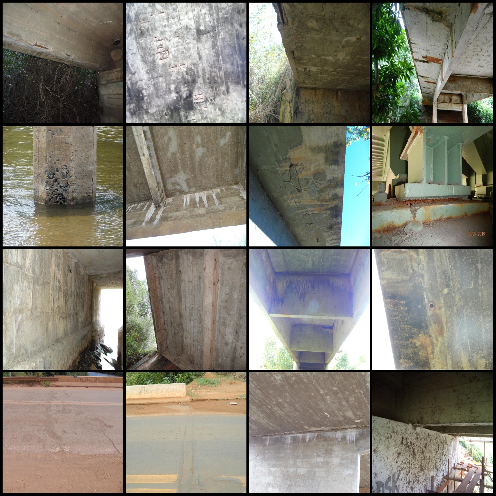
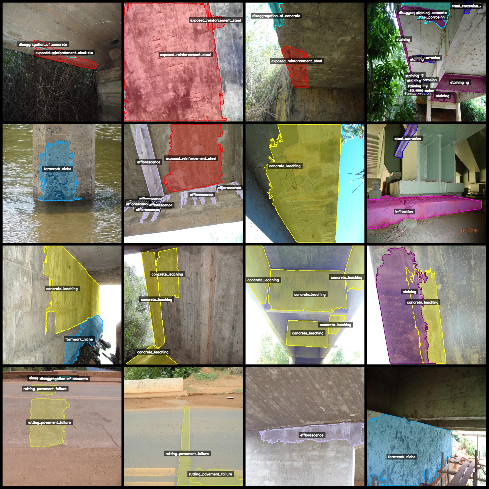
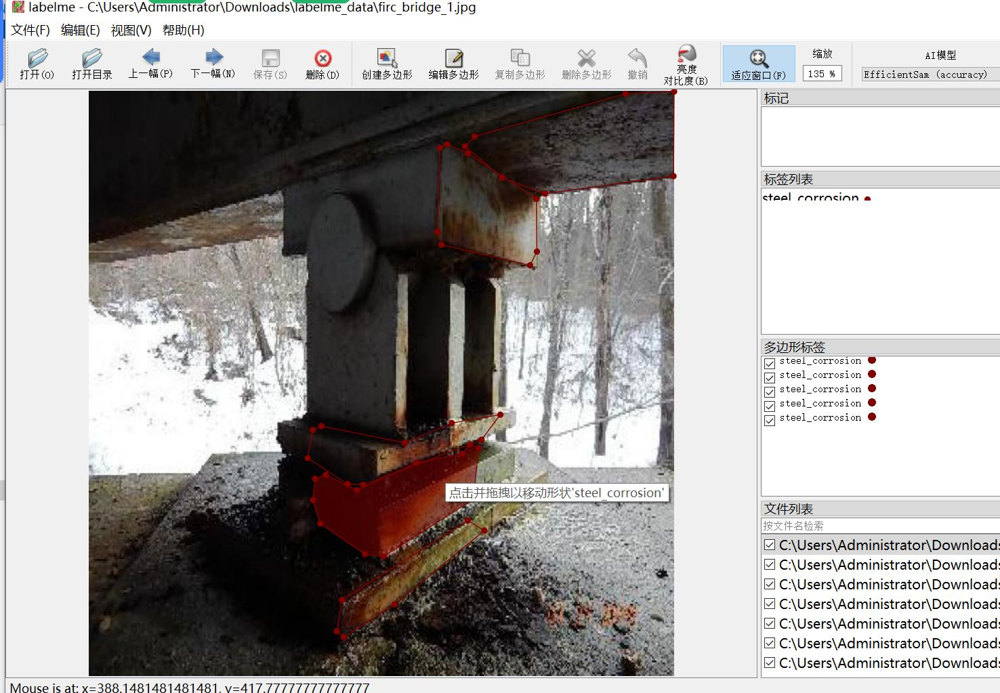

# Dataset of Label Me for Bridge Concrete Damage, Crack, Hole, Acidic, Defects and Division

The dataset format is labelme format (without mask files, only containing jpg images and corresponding json files).
The number of images (number of jpg files): 9398
annotation count: 9398  
annotationnumber of classes: 18  
annotation class names:["steel_corrosion","exposed_reinforcement_steel","infiltration","staining","crack","efflorescence","concrete_leaching","disaggregation_of_concrete","deep_crack","embankment_erosion","expansion_joint","rutting_pavement_failure","pothole_asphalt","faunal_biodegradation","fire_damaged","guardrail_damaged","formwork_niche","broken_drain"]  
The number of boxes annotated in each category:
steel_corrosion (rebar corrosion) count = 1249
Exposure of Reinforcement Steel (Stress-relieved) count = 3755
Infiltration count = 1807  
Staining count = 5198  
Crack count = 796  
Efflorescence count = 5466  
Concrete leaching count = 6762
Disaggregation of concrete count = 1681  
Deep crack count = 183  
Erosion count = 464  
Expansion joint count = 462  
Rutting pavement failure count = 977  
Pit in asphalt count = 683  
Faunal biodegradation count = 1802  
Fire damage count = 83  
Guardrail damage count = 415  
Formwork niche count = 993  
Broken drain count = 201
Total frame count: 32977  
Labeling tool used: labelme=5.5.0  
Application area: Defect detection for concrete structures and related infrastructures such as bridges, tunnels or buildings.  
Image resolution: 640x640  
Labeling rules: Polygon is drawn around each category.  
Important notes: The dataset can be opened and edited using labelme, but the JSON data needs to be converted into a mask, yolo format or coco format for semantic segmentation or instance segmentation.
Special Statement: This dataset does not guarantee the accuracy of the trained models or weight files.
Image Preview:
Annotation Example:
Original Image (Randomly selected 16 images shown):
Annotation Drawing Results:
Labelme Edited Image Example:
## Images

Here is a pay link on Stripe ( https://buy.stripe.com/3cs8yP7sY87d0vu9AB ). Please contact me lonlonago@foxmail.com after funding $89, and I will send you a complete data files , thank you!

